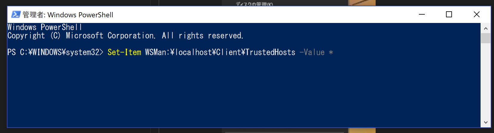

# HQ(Headquarters)

HQはPowerShellを用いて複数のPCをリモートで操作するためのGUIツールです  


# クイックスタート
### リモートPC
1. PowerShellを管理者として起動、以下のコマンドを実行  

```
Enable-PSRemoting
```  


### ローカルPC
1. PowerShellを管理者として起動し、以下のコマンドを実行  

```
Set-Item WSMan:\localhost\Client\TrustedHosts -Value *
```



1. [Release](https://github.com/fuqunaga/Headquaters/releases)ページからHQをダウンロード
1. 解凍し、HQを起動（管理者権限が必要です）
1. リモートPCのユーザ名、パスワードを入力
1. Scriptsから使用するスクリプトを選んでクリック
1. スクリプトにパラメータが必要な場合は入力
1. IP List表に対象PCのIPを記入しチェック
1. 実行ボタン（▶）でスクリプトを実行
1. 画面下部の枠に出力が表示されます  
   正常終了時は`☑[IPアドレス]:` のように表示されます
  

  
# スクリプト
場所
```
.\*.ps1
.\Scripts\*.ps1
```

 * 上記場所にファイルを置くことでユーザ独自のスクリプトを追加できます
 * IP ListのIPごとにスクリプトが呼ばれます
 * `$session`でリモートPCのPSSessionを受け取れます
 * `param()`で指定したパラメータがHQ上で表示され編集できます

## 例
#### CopyItem.ps1
 ```
param($session,$localPath,$remotePath)

Copy-Item -ToSession $session -Path $localPath -Destination $remotePath
```


#### StopProcess.ps1
```
param($session, $process)

Invoke-Command $session -ScriptBlock {
    param($process)
     Stop-Process -Name $process
} -ArgumentList ($process)
```

  
# IP List
対象となるPCのIPアドレスと、対象ごとのパラメータを記したデータ  
HQ上で編集可能です


* `.\ipList.csv` に保存されます
* 一行目はパラメータ名
* IPは範囲指定可（[IPAddressRange](https://github.com/jsakamoto/ipaddressrange/)）
  * `192.168.10.10-20`
  * `192.168.0.10 - 192.168.10.2`
  


# パラメータ
* IP Listにないパラメータは`.\param.json`に保存されます
* ユーザ名とパスワードも保存されます


# TIPS

### ⚠セキュリティに注意
パスワードは平文で保存されます。ipList.csv、param.jsonの取扱にご注意ください

### PCごとにアカウントが異なる
IPListに`UserName`、`UserPassword`というパラメータを用意するとそちらが反映されます

### System.OutOfMemoryExceptionが出る
IPListで複数のIPを指定している場合は同時実行するタスク数を制限することで回避できることがあります。
実行ボタン（▶）横のMaxTaskNumをIPListより少ない数にして試してみてください

# ライブラリ
* https://github.com/MaterialDesignInXAML/MaterialDesignInXamlToolkit - MaterialDesignInXamlToolkit
* https://github.com/jsakamoto/ipaddressrange - IPAddressRange 
* https://www.newtonsoft.com/json - Json<span />.NET
* https://github.com/Fody/Costura - Costura.Fody
