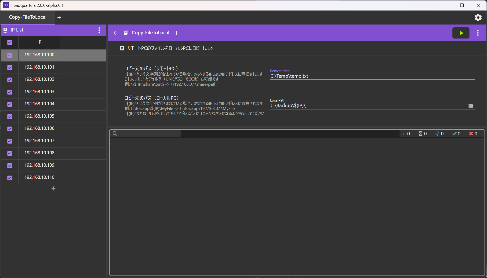

# HQ(Headquaters)
HQはPowerShellを用いて複数のPCをリモートで操作するためのGUIツールです  




# クイックスタート
1. リモートPC上でリモート操作の許可
   1. PowerShellを管理者として起動
   1. `Enable-PSRemoting`を実行
        
1. [Release]ページからダウンロード
1. 解凍し、HQを起動
1. リモートPCのユーザ名、パスワードを入力
1. Scriptsから使用するスクリプトを選んでクリック
1. スクリプトにパラメータが必要な場合は入力
1. IP List表に対象PCのIPを記入しチェック
1. 実行ボタン（▶）でスクリプトを実行
1. 画面下部の枠に出力が表示されます  
   正常終了時は`☑[IPアドレス]:` のように表示されます
  
  
# スクリプト
場所
```
.\*.ps1
.\Scripts\*.ps1
```

 * IP ListのIPごとにスクリプトが呼ばれます
 * $session でリモートPCのPSSessionを受け取れます
 * param() で指定した変数がHQ上で表示され編集できます

## 例
#### Copy-Item.ps1
 ```
param($session,localPath,$remotePath)

Copy-Item -ToSession $session -Path localPath -Destination $remotePath
```


#### StopProcess.ps1
```
param($session, $process)

Invoke-Command $session -ScriptBlock {
    param($process)
     Stop-Process -Name $process
} -ArgumentList ($process)
```

  
# IP List
対象となるPCのIPアドレスと、対象ごとのパラメータを記したデータ  
HQ上で編集可能  


* `.\ipList.csv` に保存される
* 一行目はパラメータ名
* IPは範囲指定可（[IPAddressRange](https://github.com/jsakamoto/ipaddressrange/)）
  * `192.168.10.10-20`
  * `192.168.0.10 - 192.168.10.2`
  


# パラメータ
* IP Listにないパラメータは`.\param.json`に保存される
* ユーザ名とパスワードも保存される


# TIPS
### PCごとにアカウントが異なる場合
IPListに`UserName`、`UserPassword`というパラメータを用意するとそちらが反映される

### セキュリティに注意
パスワードは平文で保存される。扱いに注意

