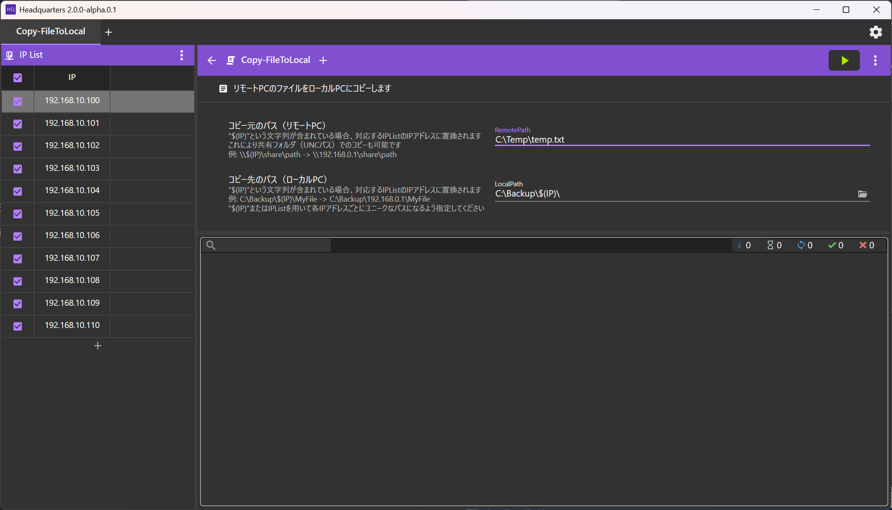
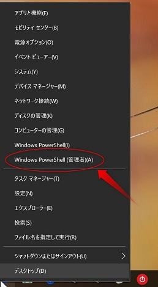
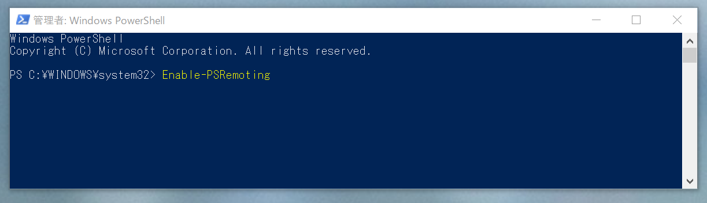
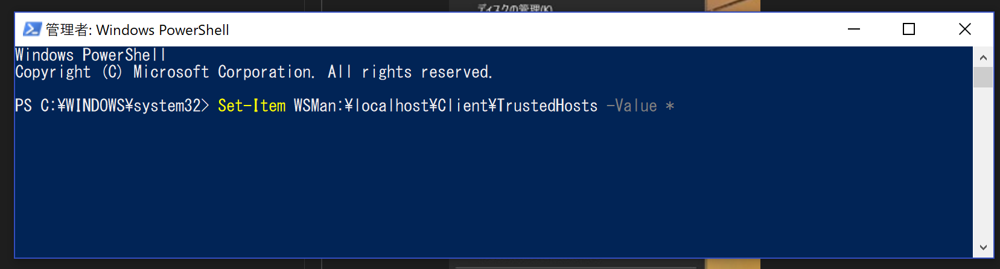
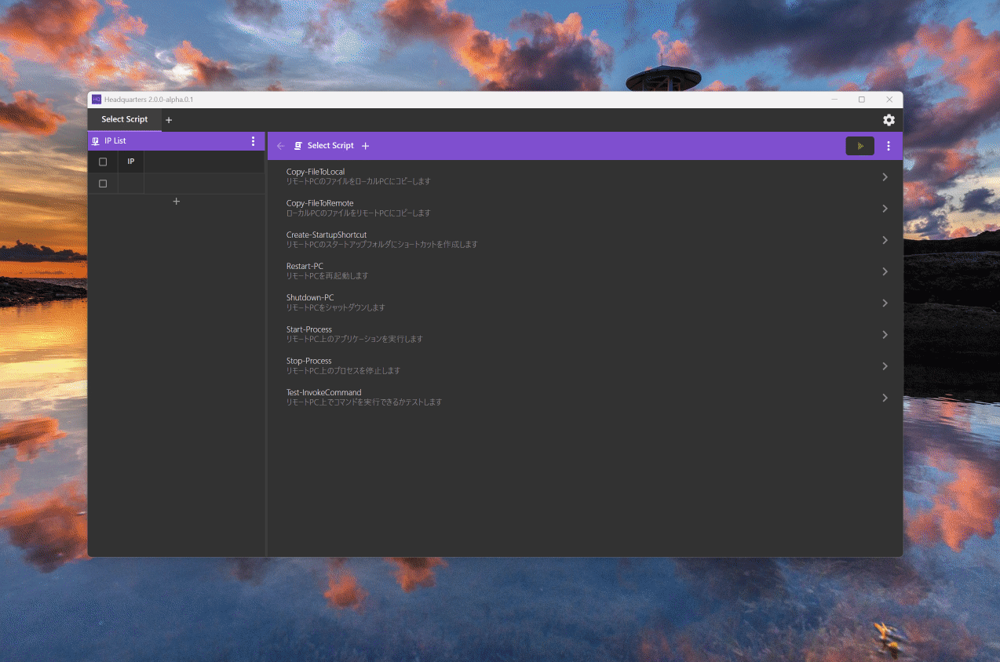
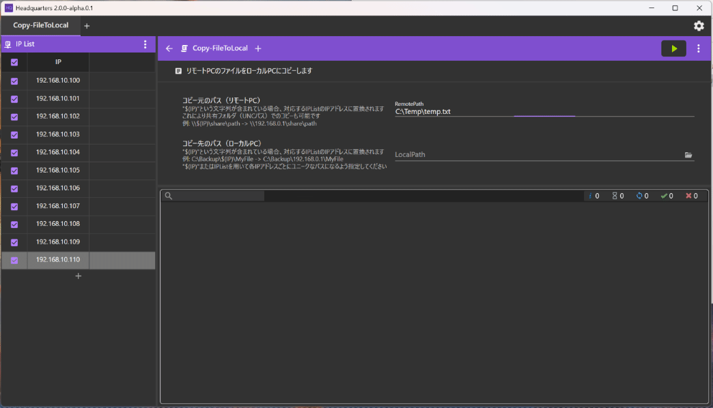

# HQ(Headquarters)
HQ is a GUI tool for remotely operating multiple windows PCs using PowerShell.

[日本語](./README-jp.md)  





# QuickStart
### Remote PC
1. Run PowerShell as an administrator, execute the following command.

```
Enable-PSRemoting
```  





### Local PC
1. Run PowerShell as an administrator, execute the following command.

```
Set-Item WSMan:\localhost\Client\TrustedHosts -Value *
```



1. Download HQ from [Release](https://github.com/fuqunaga/Headquaters/releases) page.
1. Extract and start HQ (requires administrator authority)
1. Enter user name and password of remote PC.
1. Click on the script to use from the Scripts panel.
1. Input parameters if the script requires.
1. Enter the IP of the target PC in the IP List and check.
1. Click run button(▶).
1. Output is displayed in the frame at the bottom.  
 On normal termination it will be displayed as `☑ [IP address]:` 


  
# Script
File path:
```
.\*.ps1
.\Scripts\*.ps1
```

 * You can add your own script by putting the file in the above place.
 * A script is called for each IP on th IP List.
 * A script can receive PSSession of remote PC with `$session`.
 * Variables specified with `param()` are displayed on HQ and can be edited.

## Examples:
#### CopyItem.ps1
 ```
param($session,$localPath,$remotePath)

Copy-Item -ToSession $session -Path $localPath -Destination $remotePath
```


#### StopProcess.ps1
```
param($session, $process)

Invoke-Command $session -ScriptBlock {
    param($process)
     Stop-Process -Name $process
} -ArgumentList ($process)
```

  
# IP List
IP address and parameter table for each PC.  
Editable on HQ.



* saved in `.\ipList.csv`
* The first row is the parameter name.
* IP can be a range([IPAddressRange](https://github.com/jsakamoto/ipaddressrange/)).
  * `192.168.10.10-20`
  * `192.168.0.10 - 192.168.10.2`
  


# Parameter
* Parameters that are not in the IP List are saved in `.\param.json`.
* User name and password are also saved.


# TIPS
### ⚠No Security
The password is saved in plaintext.  
Be careful with handling param.json and ipList.csv.

### Accounts are different for each PC
If you prepare parameters`UserName`, `UserPassword` in IPList, it will be used.

### Avoiding System.OutOfMemoryException
If multiple IPs are in the IPList, this may be avoided by limiting the number of tasks executed simultaneously.
Please try to be smaller than IPList the MaxTaskNum that next to run button(▶).

# Libraries:
* https://github.com/MaterialDesignInXAML/MaterialDesignInXamlToolkit - MaterialDesignInXamlToolkit
* https://github.com/jsakamoto/ipaddressrange - IPAddressRange 
* https://www.newtonsoft.com/json - Json<span />.NET
* https://github.com/Fody/Costura - Costura.Fody
